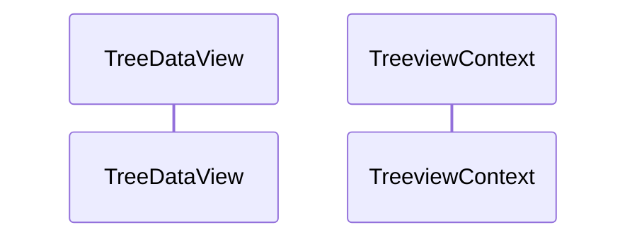

- [x] select item
- [ ] implement menu - view/item/context
- [ ] implement FileDecoration
  - [ ] scm/git status
    - see git.extension.md
- []


# gitのステータス取得
git builtin-extensionにmodelにgitステータス変更時のイベントハンドラからFileDecorationが取れそう。
vscode.extensions.getExtension("git-base").exports.model
$vscode.extensions.all.filter(x=>x.id.includes("git"))[0].exports.model.repositories[0].workingTreeGroup.resourceStates

vscode.extensions.getExtension("vscode.git").exports.model.repositories[0].workingTreeGroup.resourceStates

# TreeDataProviderの動作 
View上に表示されていないものに対してgetChildren,getTreeItemが呼ばれ、この結果はキャッシュされる。
onDidChangeTreeData.fireでキャッシュはクリアされる。



## when clause
これらをパースできること。
```
x !editorReadonly
x !(editorReadonly || inDebugMode)
x textInputFocus && !editorReadonly
x isLinux || isWindows
x !foo && bar	
x (!foo) && bar
x !foo || bar	
x (!foo) || bar
x foo || bar && baz	
x foo || (bar && baz)
 !foo && bar || baz	
 (!foo && bar) || baz
 !(foo || bar) && baz
 editorLangId == typescript
 editorLangId == 'typescript'
 resourceExtname != .js
 resourceExtname != '.js'
 editorLangId === typescript
 editorLangId === 'typescript'
 resourceExtname !== .js
 resourceExtname !== '.js'
 resourceFilename == 'My New File.md'
 gitOpenRepositoryCount >= 1
 gitOpenRepositoryCount>=1
 resourceScheme =~ /^untitled$|^file$/
 resourceScheme =~ /file:\\/\\//&&
 resourceFilename in supportedFolders
 resourceFilename not in supportedFolders
```