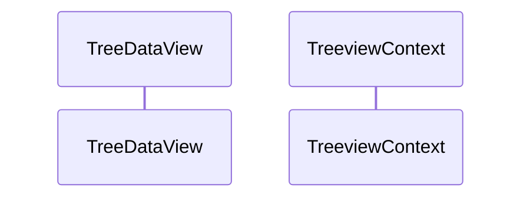

- [x] select item
- [ ] implement menu 
  - [ ] view/item/context
    - [x] "group":"inline" 
    - [ ] non "group":"inline" 
      - [ ] webview/contextへのデリゲート
  - [ ] contextmenu - webview/context
    - see contextmenu
- [ ] implement FileDecoration
  - [ ] scm/git status
    - see gitのステータス取得
- [ ] when clause
  - [x] parser/ast
  - [x] webviewへ渡す際、ast-functionが遅れない
    - webview側でparseするように修正

# contextmenu
 view/item/contextの`"group":"inline"なし`はコンテキストメニューとして扱われる。
 webviewではwebview/context, data-vscode-contextで制御する。
 webview/contextでのcommand実行は( [args: dataset.vscodeContext])=>{}として扱われる。
 view/item/contextは( [args: TreeItem])=>{}。
 なので、webview/contextは`"group":"inline"なし`から下記のように変換が必要。
```
//  view/item/context
        {
          "command": "vscode-webview-treeview.openFile",
          "when": "view == treeviewDemo"
        }
        ↓
//  webview/context
        {
          "command": "treeview:vscode-webview-treeview.openFile",
          "when": "webviewId == treeviewDemo && view == treeviewDemo"
        }
//  command
      {
        "command": "vscode-webview-treeview.isFolder",
        "title": "is folder",
        "icon": "$(file-folder)"
      },
      {
        "command": "treeview:vscode-webview-treeview.isFolder",
        "title": "is folder",
        "icon": "$(file-folder)"
      }
```

```
<div data-vscode-context={JSON.stringify({view: viewId})}>
   <item data-vscode-context={JSON.stringify({index})}/>
</div>
```

```
function registerdelegateCommand(command, action:(e)=>{}){
  vscode.commands.registerCommand("treeview:"+command, ([{index: number, view: string}]) => {
    const treeview = treeviewFromId.get(index);
    vscode.commands.executeCommand(command, treeitem);
  });
}
```
# gitのステータス取得

git builtin-extensionにmodelにgitステータス変更時のイベントハンドラからFileDecorationが取れそう。
```
vscode.extensions.getExtension("git-base").exports.model
$vscode.extensions.all.filter(x=>x.id.includes("git"))[0].exports.model.repositories[0].workingTreeGroup.resourceStates

vscode.extensions.getExtension("vscode.git").exports.model.repositories[0].workingTreeGroup.resourceStates
```

# TreeDataProviderの動作 
View上に表示されていないものに対してgetChildren,getTreeItemが呼ばれ、この結果はキャッシュされる。
onDidChangeTreeData.fireでキャッシュはクリアされる。


```mermaid:

sequenceDiagram
  participant tree as TreeDataView
  participant context as TreeviewContext
```

## when clause

これらをパースできること。
```
x !editorReadonly
x !(editorReadonly || inDebugMode)
x textInputFocus && !editorReadonly
x isLinux || isWindows
x !foo && bar	
x (!foo) && bar
x !foo || bar	
x (!foo) || bar
x foo || bar && baz	
x foo || (bar && baz)
 !foo && bar || baz	
 (!foo && bar) || baz
 !(foo || bar) && baz
 editorLangId == typescript
 editorLangId == 'typescript'
 resourceExtname != .js
 resourceExtname != '.js'
 editorLangId === typescript
 editorLangId === 'typescript'
 resourceExtname !== .js
 resourceExtname !== '.js'
 resourceFilename == 'My New File.md'
 gitOpenRepositoryCount >= 1
 gitOpenRepositoryCount>=1
 resourceScheme =~ /^untitled$|^file$/
 resourceScheme =~ /file:\\/\\//&&
 resourceFilename in supportedFolders
 resourceFilename not in supportedFolders
```