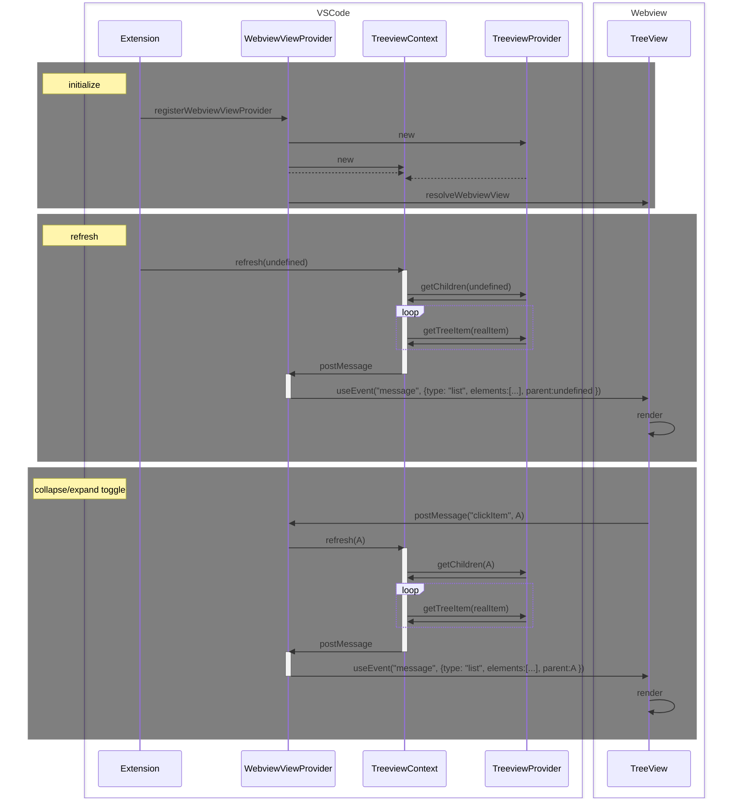

```mermaid
sequenceDiagram
  box VSCode
    participant EXT as Extension
    participant VWebV as WebviewViewProvider
    participant VTContext as TreeviewContext
    participant VTProvider as TreeviewProvider
  end
  box Webview
    participant TV as TreeView
  end

  rect rgb(0,0,0, 0.5)
    NOTE left of EXT : initialize
    EXT ->> VWebV : registerWebviewViewProvider
    VWebV ->> VTProvider : new 
    VWebV ->> VTContext : new 
    VWebV -->> VTContext : 
    VTProvider -->> VTContext : 
    VWebV ->> TV : resolveWebviewView
  end

  rect rgb(0,0,0, 0.5)
    NOTE left of EXT : refresh
    EXT ->> VTContext : refresh(undefined)
    activate VTContext
    
    VTContext ->> VTProvider : getChildren(undefined)
    VTProvider ->> VTContext : 

    loop 
      VTContext ->> VTProvider : getTreeItem(realItem)
      VTProvider ->> VTContext : 
    end

    VTContext ->> VWebV : postMessage
    deactivate VTContext
    activate VWebV
    VWebV ->> TV : useEvent("message", {type: "list", elements:[...], parent:undefined })
    deactivate VWebV

    TV ->> TV : render

  end

  rect rgb(0,0,0, 0.5)
    NOTE left of EXT : collapse/expand toggle
    TV ->> VWebV : postMessage("clickItem", A)

    VWebV ->> VTContext : refresh(A)
    activate VTContext
    
    VTContext ->> VTProvider : getChildren(A)
    VTProvider ->> VTContext : 

    loop 
      VTContext ->> VTProvider : getTreeItem(realItem)
      VTProvider ->> VTContext : 
    end

    VTContext ->> VWebV : postMessage
    deactivate VTContext
    activate VWebV
    VWebV ->> TV : useEvent("message", {type: "list", elements:[...], parent:A })
    deactivate VWebV

    TV ->> TV : render
  end

```