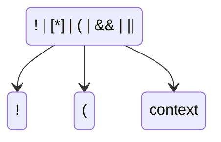
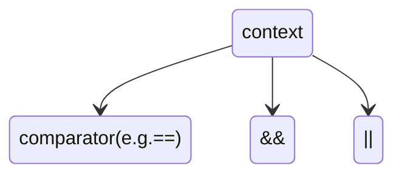
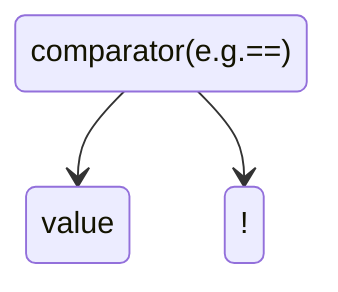
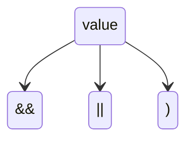

```mermaid
stateDiagram-v2
    start : ! | [*] | ( | && | ||
    start --> !
    start --> (
    start --> context
```

```mermaid
stateDiagram-v2
    start : context
    start --> comparator(e.g.==)
    start --> &&
    start --> ||
```

```mermaid
stateDiagram-v2
    start : comparator(e.g.==)
    start --> value
    start --> !
```

```mermaid
stateDiagram-v2
    start : value
    start --> &&
    start --> ||
    start --> )
```